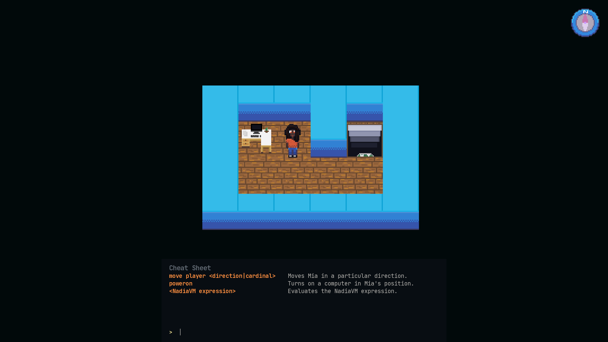
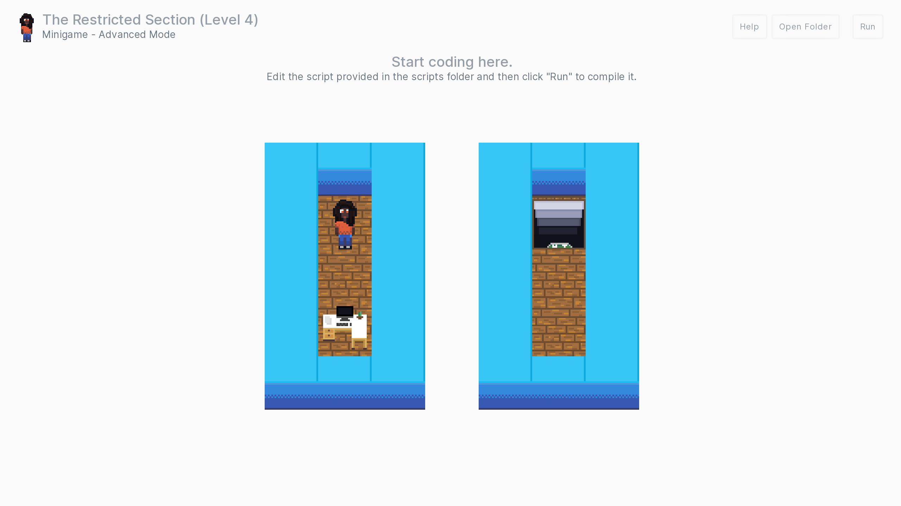

# Gameplay

In the Unscripted minigame, players play as Mia, an employee at a tech startup company, as she investigates what happened to everyone while powering on various computers around the office. Players need to make use of NadiaVM commands and exploit intentional "bugs" to solve various puzzles while avoiding obstacles.

## Gameplay Modes

There are two game modes that the minigame offers:

- **Basic mode**, where players interactively type a series of NadiaVM commands to solve puzzles
- **Advanced mode**, where players write Python scripts and/or NadiaVM files to solve puzzles

### Basic Mode

In the basic mode, players get an interactive NadiaVM console with a cheat sheet to control Mia. A compass is provided at the top to provide directions, and the console supports using the up arrow key to auto-fill in the previous command. Output for this virtual machine can appear in the game's logs for debugging purposes.

The console accepts all valid NadiaVM commands and will execute them accordingly, such as `set`, `alloc`, and `bind`.

!!! warning "Limitations"
    There are also some limitations of basic mode in the minigame:

    - When the player moves, they do _not_ automatically turn on nearby computers, meaning that players will need to explicitly tell Mia to turn the computer on. However, the player does _not_ need to tell Mia to exit the level.
    - The console cannot run any pre-compiled files. All commands must be entered manually.
    - Errors are not displayed in the console.
    - Commands cannot be chained.

### Advanced Mode

In the advanced mode, players are offered the ability to solve puzzles programmatically using Python or another language that can compile NadiaVM files. The Fira package offers an official API that can be used to write the necessary code. Players do not see a VM input view or any buttons for inputting commands, but rather see the world preview.

By default, the advanced mode is disabled; it can be enabled in **Settings &rsaquo; Minigame** by ticking "Enable advanced mode".

!!! warning "Limitations"
    There are also some limitations to the official API when using Advanced Mode:

    - When using `get_level_information` to write code, [layers should not use the `player` variable. This conflicts with the game's own player variable.
    - When using `get_level_information`, the Python script must end with the [`exit`](../api/player/#exit) command if using the official Fira API. The player's exit command is also responsible for writing the virtual machine file.
    - Some aspects of the minigame may work unexpectedly when using `get_level_information`. The API has been designed with some safety checks but is not a safeguard against Python's quirks.
